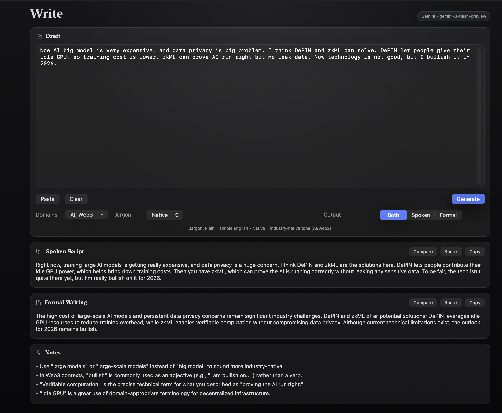
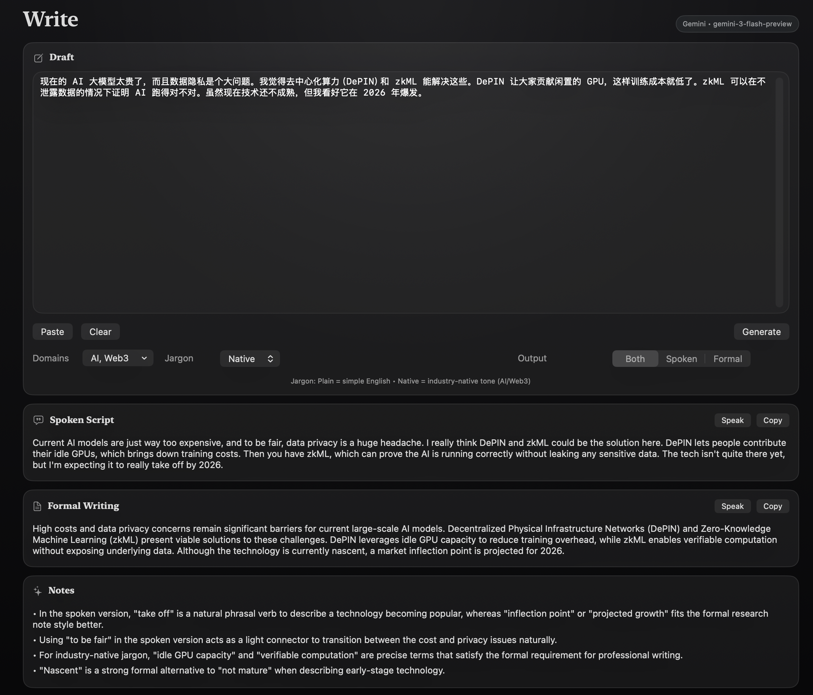
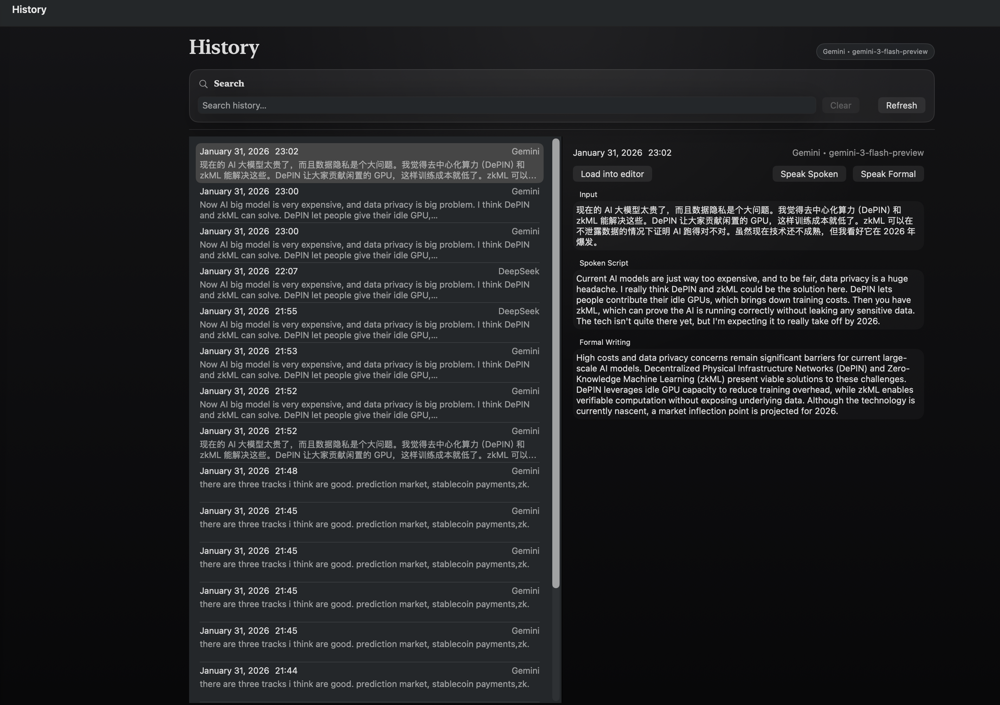
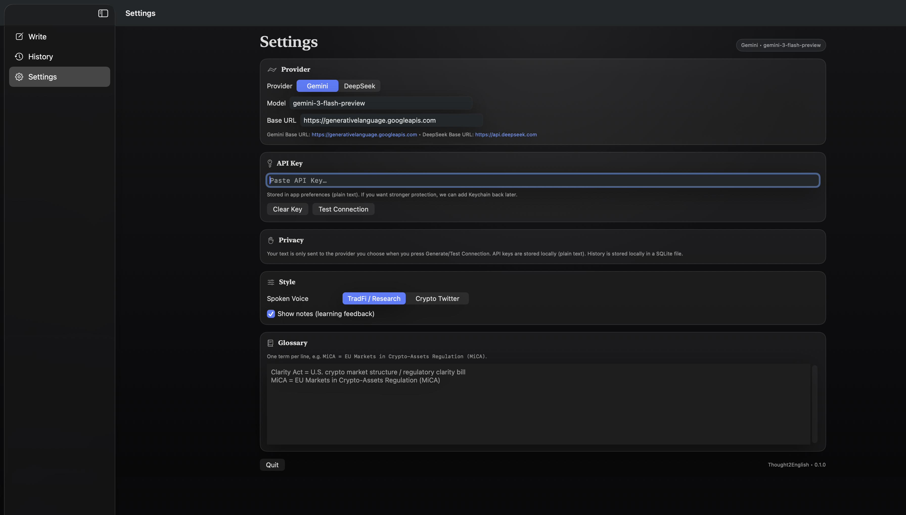
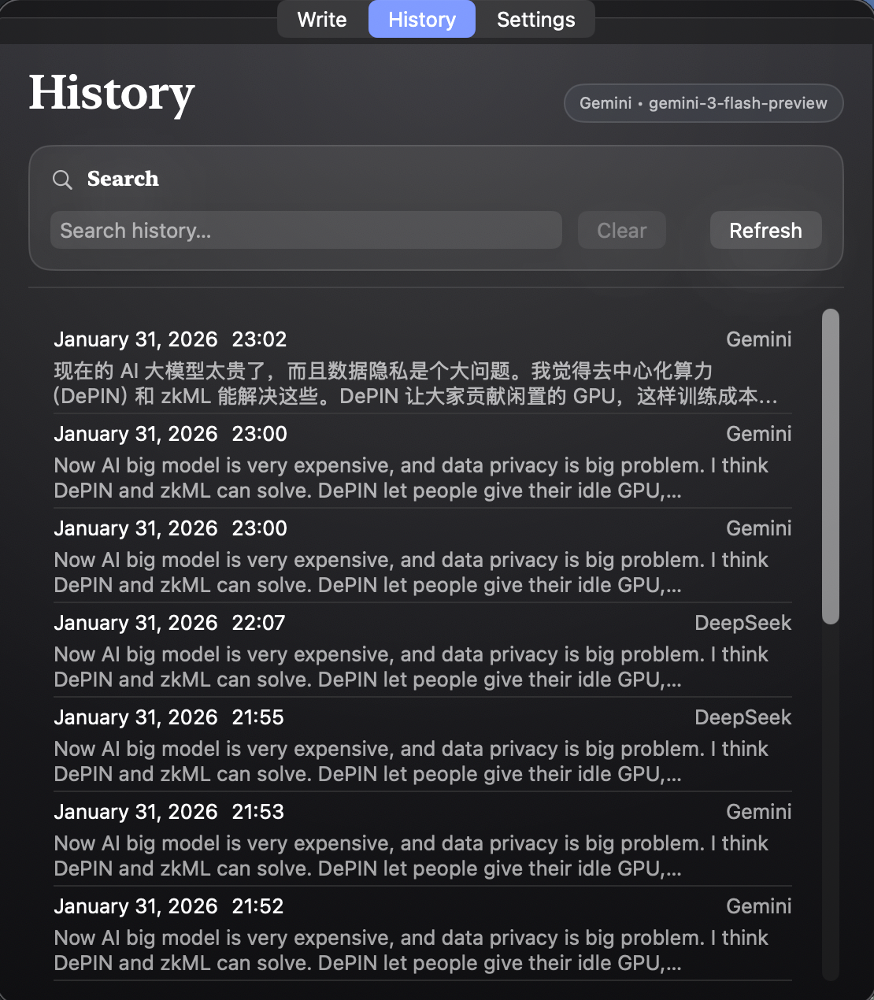

# Thought2English

[中文](README.md)

A small macOS helper that turns your daily notes (Chinese or English) into two English outputs:

- **Spoken Script**: more conversational, closer to “how you’d actually say it” (Crypto Twitter / industry-native tone)
- **Formal Writing**: more professional and workplace-friendly

Supports **Gemini** and **DeepSeek** using your own API keys.

## Screenshots

### Main Window









### Menu Bar





## Install (recommended)

```bash
brew tap jnhflow21/thought2english
brew install --cask thought2english
```

Upgrade:

```bash
brew upgrade --cask thought2english
```

## Usage

1) Open Thought2English  
2) Paste Chinese or English in Write  
3) Choose output (Spoken / Formal / Both)  
4) Click Generate, then copy or speak  

## Configuration

Configure in **Settings**:

- Provider (Gemini / DeepSeek)
- Model
- Base URL
- API Key

Recommended defaults:

- DeepSeek: Base URL `https://api.deepseek.com`, model `deepseek-chat`
- Gemini: Base URL `https://generativelanguage.googleapis.com`, model `gemini-3-flash-preview`
